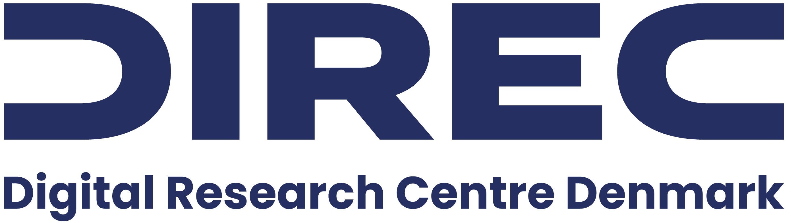
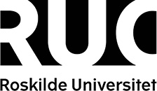
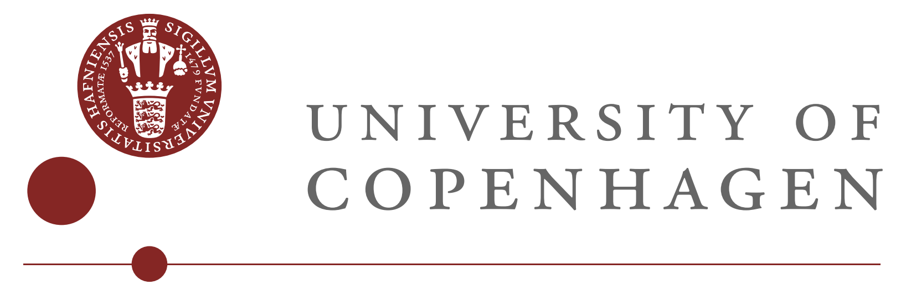

## About SUITS 2025
This 3-day seminar (over 4 days) will bring together researchers within sustainable IT, i.e. energy-efficiency and green programming to identify open problems, foster new research ideas and collaborations, and discuss new and ongoing work. An important aim of the seminar is to enable PhD students and young researchers to spar with experienced Danish and international researchers.

[If you want to receive information about SUITS, please, fill the form in this link.](https://nettskjema.no/a/suits)

### Purpose
The purpose of the symposium is to foster collaboration and knowledge exchange within the emerging and dynamic field of sustainable IT.
To this end, the 4-day symposium will bring together scientists and PhD students to explore the interdisciplinary challenges of achieving sustainability in computing. As this area inherently spans multiple domains of computer science, the symposium will be _the first of its kind in Denmark_ to convene researchers from across the national scientific community—spanning software engineering, systems, hardware, and networks—to spark new collaborations between previously disconnected fields.

Beyond supporting established researchers, the symposium also aims to strengthen the growth layer by building a research network that empowers early-career researchers. To support this effort, four international experts from diverse, cross-cutting areas of sustainable IT have been invited to anchor the program with keynote lectures and active participation.

## Important dates

Registration deadline: TBD 
Late Registration deadline: TBD  
Symposium dates: September 22 - 25 2025

* <a href="call-for-participation.html">Call for participation</a>

## Invited speakers
The symposium will feature four internationally recognized keynote speakers, each representing a crucial subfield within sustainable IT systems. Together, they cover the energy and carbon implications of ICT infrastructures from hardware and networks to software and systems-level optimization. All keynotes have confirmed their participation.

* [Jens Malmodin]() 
  Senior Specialist, Ericsson Research, Ericsson AB, Sweden  
  Jens Malmodin is an expert in environmental assessments and life cycle analysis within the Information and Communication Technology (ICT) sector. He will give the opening keynote on evaluating the energy consumption and greenhouse gas emissions associated with ICT products, networks, and services.
* [Fernando Castor](https://fernandocastor.github.io/) 
  Associate Professor, University of Twente, Netherlands  
  Fernando Castor is an expert in efficient methods for developing energy-efficient software systems, e.g, leveraging design diversity of pre-existing software components and employing software refactoring techniques. He will deliver a keynote on green software development.
* [Michael Welzl](https://www.mn.uio.no/ifi/english/people/aca/michawe/) 
  Professor, University of Oslo, Norway  
  Michael Welzl is an expert transport protocols, congestion control, and optimizing network operations to minimizing energy waste in data transmission. He is chairing the Internet Research Task Force _Sustainability and the Internet Proposed Research Group_
  He will deliver a keynote lecture on energy-efficient networking and data transmission.
* [Kerstin Eder](https://research-information.bris.ac.uk/en/persons/kerstin-i-eder)  
  Professor, University of Bristol, United Kingdom  
  Kerstin Eder is an expert in energy-aware system design and verification. Her research on energy transparency, modeling, and optimization for embedded systems and processors, including frameworks like EACOF and EnergyAnalyzer, has advanced sustainable computing. She will deliver a keynote on software-driven energy efficiency and system-level optimization.

## Organisation chairs

  * Maja Hanne Kirkeby, Roskilde University
  * Michael Kirkedal Thomsen, University of Copenhagen and University of Oslo

  <a href="organisation-committee.html">Detailed Organisation Committee</a>

## Sponsor and support

<figure>
  
  <figcaption>Support was gratefully received from DIREC, Digital Research Centre Denmark.</figcaption>
</figure>
<!-- <figure>
  
  <figcaption>Sponsorship was gratefully received from the PROSA, Danish union for IT-professionals.</figcaption>
</figure>
 -->
<figure>
  
  <figcaption>Roskilde University supports SUITS'25 with organisation.</figcaption>
</figure>
<figure>
  
  <figcaption>University of Copenhagen supports SUITS'25 with organisation.</figcaption>
</figure>

## Contact

Information Form

For questions, contact Maja Hanne Kirkeby <majaht@ruc.dk> or Michael Kirkedal Thomsen <m.kirkedal@di.ku.dk>.

[If you want to receive information about SUITS, please, fill the form in this link.](https://nettskjema.no/a/suits)
